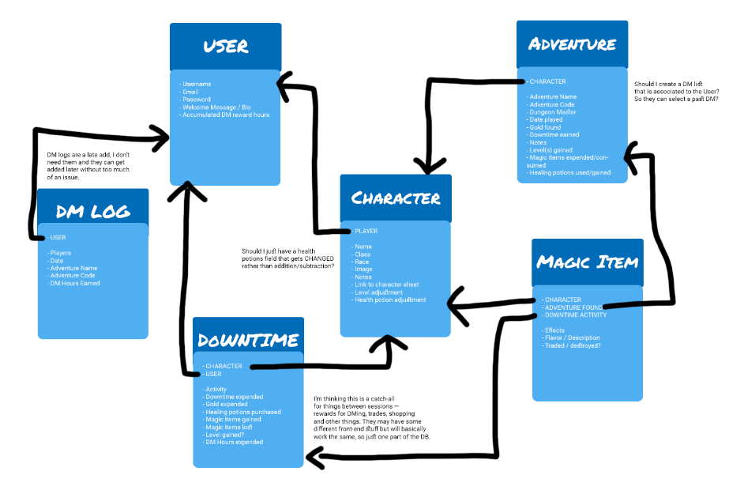

# The Bargewright Inn

A simple solution to log D&D 5e Adventurers League games. 

After creating an account, users can track their characters' adventures, trades and other activities. The app will total their levels gained, gold, story awards, magic items, and more. This is a living platform, so if you have suggestions please submit an issue and I'll see what I can do. Roadmap is below.

The app is made as a fan site under the D&D license. I am deeply indebted to [Adventurers League Log](https://www.adventurersleaguelog.com/users/3397/characters), partially for inspiration, partially for making season 8 tracking less of a mess.

Finally, although this is in one repo it is deployed as separate frontend and backend pieces.

[Visit the Bargewright Inn]()

## Screenshots

Users can login on the homepage.

A user's homepage shows a sortable list of their characters — clicking any of the characters takes them to that character's own page. The quicklinks also let users go directly to log a new adventure.

A character's homepage works similarly to a user's homepage with sortable columns — but also lets you toggle what information you see between adventures, magic items, and downtime activities.

Users are able to add or destroy magic items on adventures, as well as enter story awards and other boons.

When characters enter magic items, it first queries [https://www.dnd5eapi.co](https://www.dnd5eapi.co) for a list of all magic items, and if one is selected it populates the related fields. If it's a different item, the user can create the item and enter the details themselves

Options to go back are generally at the bottom of the page the user is on — but clicking the logo in the upper left or "my account" will take the user back to their homepage.

## Motivation

This project was created as:
1. A learning tool for react and more complex database management
2. An exercise in understanding data relationships in Mongo

## Technology used

The Bargewright Inn was created using react and mongoose.

## Challenges

This project was an iteration on a previous build that used express-react-views. It was difficult at times to reconcile solutions from previous code, and ultimately was easier once I decided this would be a full rebuild rather than starting with a restructure.

The process was much easier working from a more robust ERD than my previous project — it gave me a clear sense of what order to build out components in.

I struggle with organization a bit. I left everything inside of pages and components folders, and realize I should have broken them down into areas of each, like a folder in components related to downtime, magic items, and adventures.

Finally, I struggled a lot with feature creep. Since I want to functionally use this, I had some trouble deciding where was the right place to stop for this deadline. There are features I want to implement that will have to wait and that's okay.

## Future improvements

This is version 1.0 of The Bargewright Inn, built as a minimum viable product to start iterating on. Planned improvements currently start with:

FEATURES
1. A way to log DM rewards for users, then apply them to characters.
2. Image upload capability so users don't just add links to images. This increases the cost of the site from 0, but would be nice.
3. Explore using a relational database instead of MongoDB.
4. Explore uploading a csv that creates a character — particularly designed around the download from adventurer's league log.
5. Create a printable version so people can export characters if they need to print their log. 
6. Autofill adventures based on what's in the database if the title is matching.
7. Make scrolls, potions, etc that are the same name handle in an inventory rather than all separate items.

DESIGN
1. I did very minimal mobile style work, and I actually care more about it as a mobile platform than a desktop one. It's easy to remember to log your adventures when you play online because you're already at a computer. It's a bit more of a challenge when you're playing face to face.
2. I like the display more than the entry forms — the forms across the board need design attention.
3. I'm not convinced about the structure I built out in general — I think there's a way to make it easier to parse.
4. The "other details" section is a bit weak in terms of design, and could use some attention.

BUILD
1. Most of the fields on the character home page add, rather than total during pre-save and updates. I wound up here because that component doesn't consistently re-render, and finding a way to do that would let me decrease the resources required to load already bulky pages.
2. Some of the edit functions aren't as robust as the creation ones, and I want to smooth that difference out.
3. Explore using context for some pieces of information, particularly the breadcrumb navigation. The current system is not what I want to use.

Progress is tracked on [This Trello board](https://trello.com/b/i87kvULr/bargewright-2).

## Disclaimer

The Bargewright Inn bears no responsibility for any collisions that may occur as a result of charging headlong into battle after too many pints of Dragondew, Firedrake or Evermead. Do not blame The Bargewright Inn for any squabbles that occur as a result of a DM checking your logs. Despite the record keeping service offered by the Inn, however, the Inn hopes that any DM who does check logs of a player is tossed into the gaping maw of Dendar the night serpent. Unless, of course, that player is rude and disruptive, in which case, may Tyr bless you.